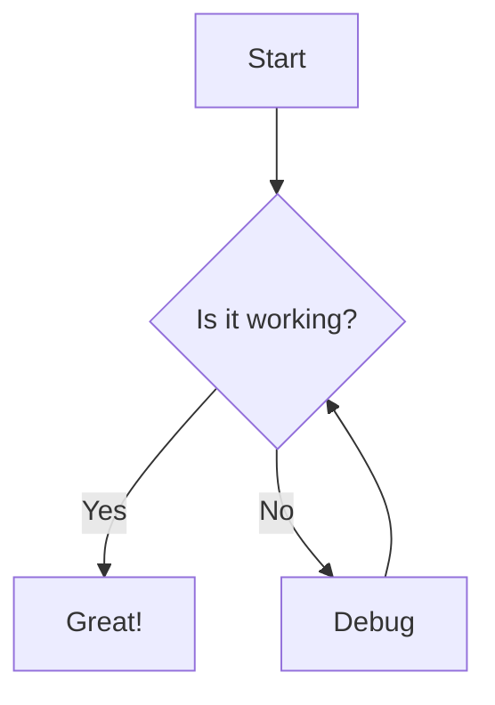

# One HTML page Modern Mermaid Interpreter

Modern web application for creating, visualizing, and sharing Mermaid diagrams with ease!


## ✨ Features

- 🎨 **Modern UI**: Clean, intuitive interface with responsive design
- 📝 **Live Rendering**: See your diagrams update in real-time
- 🔍 **Zoom Controls**: Easily zoom in/out to focus on diagram details
- 💾 **Export Options**: Download diagrams as PNG or SVG
- 📋 **Copy to Clipboard**: Copy diagrams directly to your clipboard
- 📱 **Mobile Friendly**: Works on all devices with adaptive layout
- 🖱️ **Pan & Zoom**: Navigate large diagrams with intuitive controls
- 🌐 **No Server Required**: Runs entirely in your browser
- 🔄 **Multiple Diagram Types**: Support for all Mermaid diagram types

## 📊 Supported Diagram Types

- Flowcharts
- Sequence Diagrams
- Class Diagrams
- State Diagrams
- Entity Relationship Diagrams
- Gantt Charts
- Pie Charts
- User Journey Maps
- Git Graphs
- Mindmaps
- Timelines

## 🚀 Getting Started

1. Clone this repository:
   ```
   git clone https://github.com/yourusername/mermaid-interpreter.git
   ```

2. Open `index.html` in your browser or serve it with a simple HTTP server:
   ```
   python -m http.server
   ```

3. Start creating diagrams! Select an example from the dropdown or write your own Mermaid code.

## 💻 Usage

1. **Write Mermaid Code**: Enter your Mermaid syntax in the code editor
2. **Render**: Click the "Render" button or press Ctrl+Enter
3. **Adjust View**: Use zoom controls to adjust the diagram size
4. **Export**: Download as PNG or copy to clipboard
5. **Examples**: Try out different diagram types from the examples dropdown

## 📝 Example



## 🛠️ Technologies Used

- HTML5, CSS3, JavaScript
- [Mermaid.js](https://mermaid.js.org/) for diagram rendering
- [Font Awesome](https://fontawesome.com/) for icons

## 📱 Mobile Support

The application is fully responsive and works on mobile devices. On smaller screens, the code editor can be toggled to maximize screen space for diagram viewing.

## 🔮 Future Enhancements

- Theme switching (light/dark mode)
- Local storage for saving diagrams
- Sharing via URL
- More export options
- Custom styling for diagrams

## 📄 License

This project is licensed under the MIT License - see the LICENSE file for details.

## 🙏 Acknowledgements

- [Mermaid.js](https://mermaid.js.org/) for the amazing diagramming library
- All contributors and users of this tool
